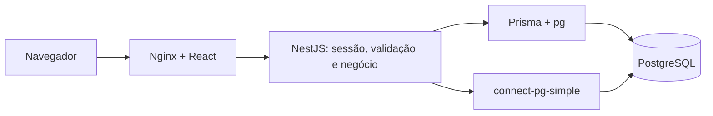

# Cubity Support

**Portal de Solicitações Internas da bit Soluções.** Aplicação full stack para registrar demandas, acompanhar atendimento e consultar indicadores, com React, NestJS e PostgreSQL.

[Screenshots](#screenshots) · [Funcionalidades](#funcionalidades) · [Arquitetura](#arquitetura) · [Executar](#executar-localmente) · [Testes](#testes-e-validação) · [Documentação de entrega](docs/README.md)

## Visão do projeto

| Área         | Implementação                                                        |
| ------------ | -------------------------------------------------------------------- |
| Frontend     | React 19, TypeScript, Vite, Tailwind CSS, shadcn/ui e variantes `tv` |
| Backend      | NestJS 12 em ESM, módulos, guards, pipes Zod e API REST documentada  |
| Banco        | PostgreSQL 17, Prisma 7, migration SQL e seed idempotente            |
| Autenticação | Sessão persistente no servidor, cookie HttpOnly e proteção CSRF      |
| Execução     | Docker Compose com banco, migration, API e Nginx na mesma origem     |
| Qualidade    | Checks, testes HTTP/SQL/contratos, GitHub Actions e evidências reais |

## Screenshots

Capturas reais do frontend conectado à API e ao PostgreSQL, com dados fictícios em ambiente isolado. A [galeria completa](docs/screenshots/README.md) inclui login, cadastro, edição, permissões, evolução dos status, filtros e mobile.

### Dashboard

Indicadores globais de todas as solicitações, independentes dos filtros da lista.


### Solicitações

Consulta por código, título, categoria, solicitante, data de abertura e status, com filtros combináveis.


### Cadastro

Título, descrição e categoria são informados pelo usuário. Código, data, solicitante e status inicial são definidos no servidor.


### Login e mobile

| Login desktop                                                                       | Dashboard mobile                                                          |
| ----------------------------------------------------------------------------------- | ------------------------------------------------------------------------- |
|  |  |

## Funcionalidades

| Área            | Comportamento                                                                  |
| --------------- | ------------------------------------------------------------------------------ |
| Autenticação    | Login com usuário/senha, restauração da sessão e logout                        |
| Cadastro        | Título até 60 e descrição até 1.000 caracteres; categoria válida               |
| Consulta        | Todos os autenticados visualizam solicitações e detalhes                       |
| Edição/exclusão | Somente o solicitante, enquanto Aberto                                         |
| Atendimento     | Qualquer autenticado avança Aberto → Em Atendimento → Concluído                |
| Filtros         | Título parcial sem distinguir caixa, categoria, status e período inclusivo UTC |
| Dashboard       | Total e quantidades por status, sem influência dos filtros                     |
| Persistência    | Dados e sessões no PostgreSQL; seed preserva contas existentes                 |
| Observabilidade | NestJS Observe opt-in; traces do lifecycle HTTP e configuração de métricas     |

As [regras RN01–RN15](docs/requisitos.md) são verificadas no backend, inclusive condições de dono/status nas escritas concorrentes. Esta versão não inclui perfis distintos, cadastro público, anexos, comentários, SLA ou inventário.

## Arquitetura



Frontend organizado por funcionalidades; backend monolítico modular com Auth, Users, Categories, Requests e Dashboard. [Arquitetura completa](docs/arquitetura.md) · [Modelo e dicionário](docs/dicionario-de-dados.md) · [API](docs/api.md).

## Executar localmente

Requer Docker Desktop em modo Linux e Compose 2.24.4+. Portas padrão 8080 e 5432 livres. Node no host é necessário apenas para desenvolvimento fora dos containers.

```powershell
git clone https://github.com/Diasszx/HeldeskCubity.git
cd HeldeskCubity
if (!(Test-Path .docker/database.env)) {
  Copy-Item .docker/database.env.example .docker/database.env
}
if (!(Test-Path .docker/application.env)) {
  Copy-Item .docker/application.env.example .docker/application.env
}
```

**Antes de iniciar**, substitua SESSION_SECRET em `.docker/application.env` por um segredo aleatório próprio de pelo menos 32 caracteres. DATABASE_URL deve corresponder às credenciais do arquivo do banco, com host interno `db:5432`. Não versionar os arquivos locais.

```powershell
docker compose config --quiet
docker compose up --build -d --wait --wait-timeout 180
```

Abra [http://127.0.0.1:8080](http://127.0.0.1:8080). Swagger: [/api/docs](http://127.0.0.1:8080/api/docs). O job `migrate` aplica as tabelas e, com `SEED_DEMO=true`, cria as contas e cinco categorias. É esperado terminar com código 0. Um banco novo começa sem solicitações.

| Conta de demonstração | Senha pública |
| --------------------- | ------------- |
| ana.demo              | demo123       |
| bruno.demo            | demo123       |

Ambas consultam/atendem todas as demandas, mas editam/excluem apenas as próprias abertas. Contas demo são exclusivas de revisão local; seed é recusado em produção e não redefine senhas existentes.

Para parar mantendo dados: `docker compose down`. **Não usar `down -v` na rotina.** Guia detalhado: [execução e variáveis](docs/execucao.md); [Docker, HTTPS e backups](DOCKER.md). Desenvolvimento no host usa Node 24, API em 3001 e Vite em 5176.

## Estrutura

```text
HeldeskCubity/
├── backend/                # NestJS, regras, Prisma, SQL, seed e testes
├── frontend/               # React, componentes, páginas e cliente HTTP
├── docs/
│   ├── screenshots/        # Evidências reais desktop e mobile
│   ├── MEMORIAL_TECNICO_DE_DESENVOLVIMENTO.md
│   ├── execucao.md
│   ├── arquitetura.md
│   ├── requisitos.md
│   ├── banco-de-dados.md
│   ├── dicionario-de-dados.md
│   ├── api.md
│   └── validacao.md
├── .github/workflows/      # CI frontend e backend
├── .docker/                # Exemplos públicos de configuração
├── compose.yaml
├── compose.production.yaml
└── DOCKER.md
```

## Testes e validação

Em cada pasta (`frontend` e `backend`), `npm ci` instala o lockfile e `npm run check` verifica o projeto. Frontend inclui guard do design system, tipos, lint, formatação, testes e build. Backend inclui geração Prisma, tipos, lint, formatação, Jest e build. Testes reais de banco exigem serviço exclusivo `db-test` e TEST_DATABASE_URL; veja [comandos e resultados](docs/validacao.md).

A documentação distingue checks automatizados de validação no navegador e registra pendências. Screenshots não substituem testes de autorização ou concorrência. Os workflows verificam qualidade e integração; não fazem deploy.

## Documentação exigida na entrega

| Entregável                          | Acesso                                                                                |
| ----------------------------------- | ------------------------------------------------------------------------------------- |
| Código completo                     | [Backend](backend/) e [frontend](frontend/)                                           |
| Instruções completas                | [Guia de execução](docs/execucao.md)                                                  |
| Criação de tabelas                  | [SQL versionado](backend/prisma/migrations/20261003160000_initial/migration.sql)      |
| Dicionário de dados                 | [Campos, relações, defaults e índices](docs/dicionario-de-dados.md)                   |
| MEMORIAL TÉCNICO DE DESENVOLVIMENTO | [Documento técnico](docs/MEMORIAL_TECNICO_DE_DESENVOLVIMENTO.md)                      |
| Evidências funcionando              | [Galeria de screenshots](docs/screenshots/README.md) e [validação](docs/validacao.md) |

## Limites e melhorias futuras

Listagem sem paginação, bundle frontend acima de 500 kB e ausência de teste de carga. Não há recuperação de senha, provisionamento de usuários produtivos ou trilha de auditoria. Observe permanece desativado por padrão; dashboard externo/alertas dependem de credenciais e ativação. TLS real, retenção e restauração de backups exigem configuração operacional. Redis é possibilidade futura condicionada a métricas, não dependência atual.

Organização da apresentação inspirada no [Helpdesk Management System](https://github.com/roposropos/helpdesk-management-system), com conteúdo e capturas próprios deste portal.
