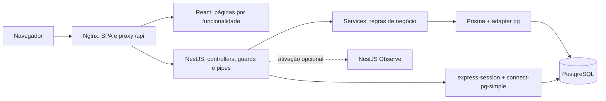
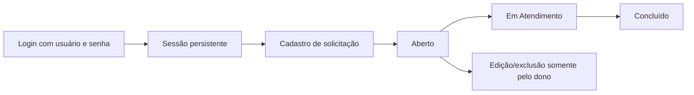

# Arquitetura

## Visão geral

Monorepositório com SPA React e API REST NestJS em ESM. O backend é um monólito modular; negócio e sessões usam o mesmo PostgreSQL, por clientes distintos. Nginx expõe frontend e `/api` na mesma origem no Compose.

| Camada                    | Responsabilidade e localização                                                             |
| ------------------------- | ------------------------------------------------------------------------------------------ |
| Páginas e funcionalidades | `frontend/src/features`: auth, requests e dashboard                                        |
| Layout e componentes      | `frontend/src/components/layout` e `ui`; shadcn/ui adaptado para variantes `tv`            |
| Comunicação               | `frontend/src/services`: fetch centralizado, cookies, CSRF, erros e adaptação de contratos |
| Controllers               | Contratos HTTP, entradas e encaminhamento aos services                                     |
| Guards/pipes              | Sessão, CSRF e validação Zod; regras repetidas no backend                                  |
| Services                  | Negócio, consultas e escritas condicionadas para concorrência                              |
| Persistência              | `backend/src/prisma`, schema e migrations em `backend/prisma`                              |
| Sessão                    | `backend/src/session`: pool `pg`, cookie e ciclo da sessão                                 |
| Configuração              | Variáveis validadas antes do startup; Swagger e filtro global de erros                     |
| Infraestrutura            | Compose, Dockerfiles, proxy Nginx e workflows GitHub Actions                               |

## Fluxo funcional

Código, dono, status inicial e data não são editáveis pelo cliente. Leitura prévia melhora as respostas, mas as escritas também exigem dono/status atual no predicado, evitando que uma alteração concorrente ultrapasse a regra. A função SQL de código usa sequência atômica, permitindo lacunas.

## Autenticação e segurança

Login verifica bcrypt, regenera a sessão e aguarda persistência. O cookie `cubity.sid` é HttpOnly, SameSite=Lax, path `/api`, host-only e Secure em produção. Prazo padrão de 8 horas sem atividade; uso autenticado renova o prazo. Logout destrói a sessão no store e expira o cookie.

O cliente consulta `/api/auth/csrf` antes de gravações e envia `X-CSRF-Token`, inclusive no login/logout. O nonce é associado à sessão e muda no login. Há verificação de origem e de `Sec-Fetch-Site`. Tokens e senhas não são persistidos no localStorage. O backend só confia nos IPs de proxy explicitamente configurados.

Erros HTTP são sanitizados; não se retornam hashes, conexão ou sessão completa. Há proteção de invariantes, mas esta documentação não certifica a aplicação como auditada. Rate limiting, recuperação de conta e provisionamento produtivo não foram implementados.

## Execução e observabilidade

Compose coordena `db` saudável → `migrate` concluído → `api` saudável → `web`. `postgres_data` persiste os dados; `db-test` tem armazenamento temporário separado. Builds em estágios usam Node 24 e Nginx; runtime sem privilégios.

Observe é opt-in e acompanha requisições/chamadas instrumentadas, não todo bootstrap/migration/shutdown. Métricas de runtime e instrumentação `pg` estão configuradas. Mensagens/stacks são mascaradas, body/headers e código-fonte não são exportados. Dashboard externo depende de credenciais e ativação. Consulte [observabilidade](../backend/OBSERVABILITY.md).
