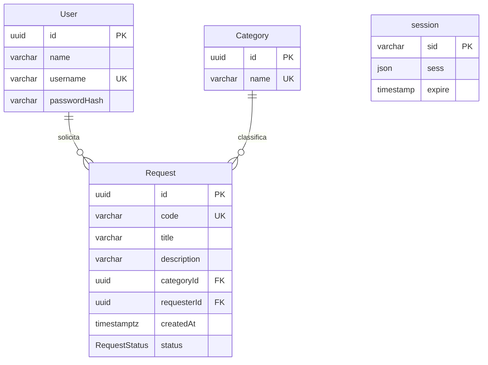

# Dicionário de dados

Derivado de [schema.prisma](../backend/prisma/schema.prisma) e da [migration SQL](../backend/prisma/migrations/20261003160000_initial/migration.sql). Os nomes físicos preservam maiúsculas e exigem aspas em SQL (`"User"`, `"Category"`, `"Request"`). **Todos os campos abaixo são NOT NULL.** UUIDs são representados como strings na API.

## User — colaboradores

| Campo        | Tipo PostgreSQL | Chave/default/restrição              | Significado                         |
| ------------ | --------------- | ------------------------------------ | ----------------------------------- |
| id           | UUID            | PK; `gen_random_uuid()`              | Identificador do colaborador        |
| name         | VARCHAR(120)    | Sem default                          | Nome de apresentação                |
| username     | VARCHAR(64)     | Único; sem default; check de formato | Usuário de login normalizado        |
| passwordHash | VARCHAR(60)     | Sem default                          | Hash bcrypt; nunca retornado na API |

`User_username_normalized`: `^[a-z0-9][a-z0-9._-]*$`. Unicidade por `User_username_key`. O banco não valida nome não vazio nem formato bcrypt: essas políticas não devem ser inferidas do tipo VARCHAR. Seed utiliza custo bcrypt 12.

## Category — categorias

| Campo | Tipo PostgreSQL | Chave/default/restrição | Significado                |
| ----- | --------------- | ----------------------- | -------------------------- |
| id    | UUID            | PK; `gen_random_uuid()` | Identificador da categoria |
| name  | VARCHAR(80)     | Único; sem default      | Nome da categoria          |

Índice único `Category_name_key`. Seed: TI, RH, Compras, Financeiro e Infraestrutura. Não há gerenciamento de categorias pela UI/API nesta versão.

## Request — solicitações

| Campo       | Tipo PostgreSQL | Chave/default/restrição       | Significado                         |
| ----------- | --------------- | ----------------------------- | ----------------------------------- |
| id          | UUID            | PK; `gen_random_uuid()`       | Identificador usado nas rotas       |
| code        | VARCHAR(32)     | Único; `next_request_code()`  | Código público sequencial SOL-0001… |
| title       | VARCHAR(60)     | Sem default; check não branco | Resumo da demanda                   |
| description | VARCHAR(1000)   | Sem default; check não branco | Descrição da demanda                |
| categoryId  | UUID            | FK → Category.id; sem default | Categoria obrigatória               |
| requesterId | UUID            | FK → User.id; sem default     | Colaborador que criou a solicitação |
| createdAt   | TIMESTAMPTZ(3)  | `CURRENT_TIMESTAMP`           | Instante de criação                 |
| status      | RequestStatus   | Default OPEN                  | Estado atual                        |

Enum `RequestStatus`: OPEN (Aberto), IN_PROGRESS (Em Atendimento), COMPLETED (Concluído). A transição sequencial é validada pelos services, não por trigger SQL. Dono também é controlado pela aplicação.

Checks `Request_title_not_blank` e `Request_description_not_blank`: rejeitam valores que correspondem a `^[[:space:]]*$`. API aplica trim e limites antes de gravar. FKs usam **ON DELETE RESTRICT / ON UPDATE CASCADE**: não se excluem usuários/categorias referenciados.

| Índice                           | Colunas               | Finalidade                 |
| -------------------------------- | --------------------- | -------------------------- |
| Request_code_key                 | code (único)          | Impedir códigos duplicados |
| Request_createdAt_id_idx         | createdAt, id         | Apoiar ordenação/período   |
| Request_categoryId_createdAt_idx | categoryId, createdAt | Categoria e período        |
| Request_status_createdAt_idx     | status, createdAt     | Status e período           |
| Request_requesterId_idx          | requesterId           | Relação com solicitante    |

Índices não garantem custo constante nem eliminam a necessidade de analisar planos de consultas com volumes reais.

## session — sessões do servidor

| Campo  | Tipo PostgreSQL              | Chave/default/restrição | Significado                                |
| ------ | ---------------------------- | ----------------------- | ------------------------------------------ |
| sid    | VARCHAR sem limite declarado | PK; sem default         | Identificador opaco da sessão              |
| sess   | JSON                         | Sem default             | Cookie, userId e csrfToken; dados privados |
| expire | TIMESTAMP(6) sem fuso        | Sem default             | Expiração controlada pelo store            |

`IDX_session_expire` indexa `expire` para expiração/limpeza. `connect-pg-simple` é responsável pelos dados desta tabela; `createTableIfMissing=false` exige migration prévia. Não existe FK entre `sess.userId` e User: o identificador fica dentro do JSON e o guard verifica o usuário. Sessões anônimas de CSRF podem não conter userId. Não exportar esta tabela como evidência pública.

## Objetos adicionais

- `public.request_code_seq`: sequência BIGINT, NO CYCLE, atômica.
- `public.next_request_code()`: função SQL VOLATILE; prefixa SOL- e preenche com zeros até no mínimo quatro dígitos. SOL-10000 não é truncado. Exclusão, rollback ou falha podem deixar lacunas; códigos não são calculados com count+1 nem reutilizados.
- `_prisma_migrations`: tabela interna gerenciada pelo Prisma ao executar migrations; não é entidade de negócio nem modelo do schema.

Para criação e seed, consulte [Banco de dados](banco-de-dados.md). Não copie schema, índices ou função para um segundo script divergente: a migration versionada é o script de criação da entrega.
