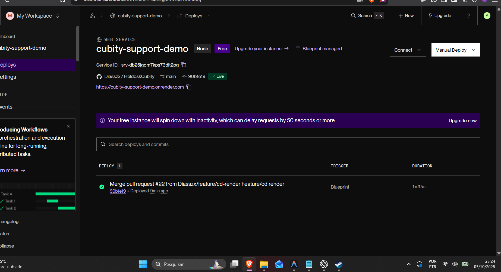
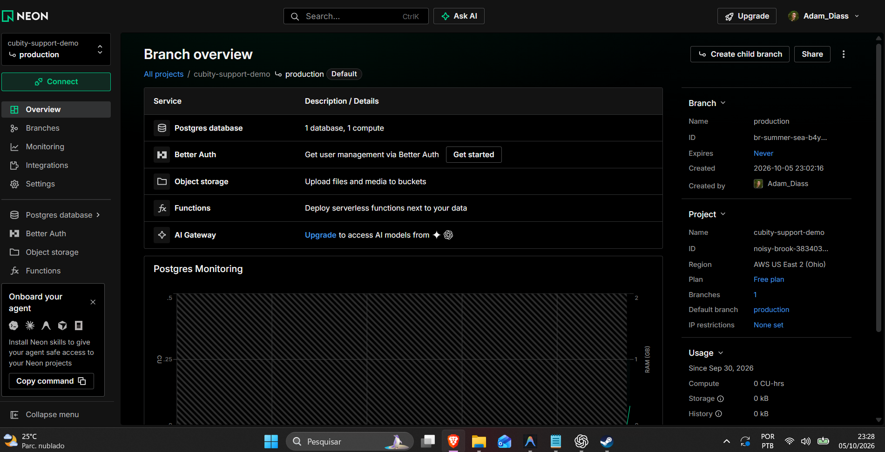
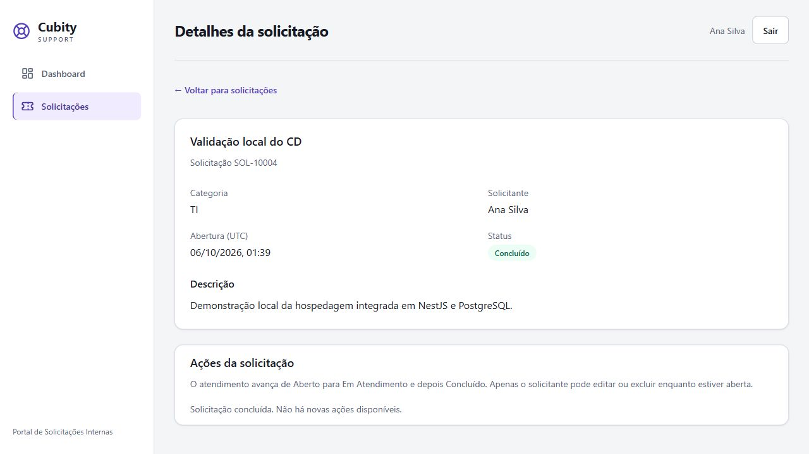
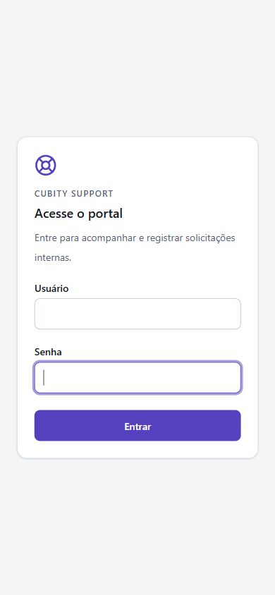

# Evidências da publicação e do CD

**Aplicação publicada:** [Cubity Support](https://cubity-support-demo.onrender.com/login).

## Evidências cloud fornecidas pelo responsável

Painel Render: serviço Free, branch `main`, commit `90b1e19`, Live e primeiro deploy por Blueprint. Comprova publicação; não comprova o gate de CI em deploy posterior.

Painel Neon: projeto `cubity-support-demo`, branch `production`, plano Free e região Ohio. Não há strings de conexão na captura.

O provisionamento real retornou sucesso e o responsável confirmou acesso. Ainda falta captura da tela autenticada cloud; a imagem anterior de login com erro não comprova login bem-sucedido.

Para completar a comprovação, registrar nesta pasta:

| Evidência                        | Arquivo previsto       | O que comprova                      |
| -------------------------------- | ---------------------- | ----------------------------------- |
| Login com URL HTTPS visível      | cd-login.png           | Aplicação acessível no domínio real |
| Solicitação e dashboard          | cd-solicitacao.png     | Uso integrado com PostgreSQL cloud  |
| CI e deploy do mesmo commit      | cd-deploy-aprovado.png | Entrega automática após checks      |
| Falha de CI no serviço de ensaio | cd-bloqueio.png        | Bloqueio de publicação              |
| Sessão/dados após reinício       | cd-persistencia.png    | Persistência fora do processo       |

Ocultar segredos, strings de conexão e dados pessoais nos screenshots. Preencher data, SHA, URL e resultado apenas depois da verificação real. Os nomes acima são roteiro de captura; não são arquivos já existentes.

## Evidências locais já capturadas em 05/10/2026

As capturas abaixo usam React compilado servido pelo NestJS em `http://127.0.0.1:8084`, com PostgreSQL exclusivo de testes. **Não são capturas do Render ou de um domínio público.**

Solicitação criada e atendida até conclusão; a recarga preservou os dados:

Login no viewport mobile de 390 px, com a dica de credenciais públicas ocultada pelo build cloud e foco visível por teclado:

## Atualização — deploy automático e ingestão Observe

Captura fornecida pelo responsável em 05/10/2026: o commit `44356b3` aparece Live e possui um deploy concluído com origem **Auto-Deploy**. O merge do PR #24, commit `8193636`, aparece em **Building**, também por Auto-Deploy. A imagem comprova acionamento automático e uma publicação anterior concluída; não comprova conclusão do deploy `8193636` nem bloqueio por falha de CI. O Service ID foi ocultado na imagem fornecida.

Captura fornecida pelo responsável em 05/10/2026: o NestJS Observe apresenta 2 requisições na janela de 1 hora, duração média de 4,26 ms, P95 de 5,80 ms e nenhum erro registrado nessa amostra. Isso evidencia ingestão de telemetria no painel; não comprova cobertura completa, alertas ou desempenho sob carga. A versão exibida é `0.1.0`, portanto esta captura não valida a identificação automática pelo commit.

