# Screenshots — aplicação funcionando

Capturas reais do Cubity Support com frontend compilado, Nginx, API NestJS e PostgreSQL. **Dados exclusivamente fictícios de demonstração**, criados pela interface em um banco/volume isolado. Sem montagem de telas, mocks de runtime, edição de conteúdo da imagem ou dados privados.

Revisão em **05/10/2026**, ambiente local `cubity-docs`, origem `http://127.0.0.1:8083`; porta 8083 é específica da captura, enquanto a instalação padrão usa 8080. Desktop: viewport 1440 × 1000; mobile: 390 × 844. JPEGs de página completa podem ter altura maior que o viewport. Datas de abertura são exibidas em UTC; por isso os registros podem mostrar 06/10 enquanto a revisão local ainda é 05/10.

## Galeria

### 01 — Login

Contas públicas de demonstração; campos sem credenciais privadas preenchidas.

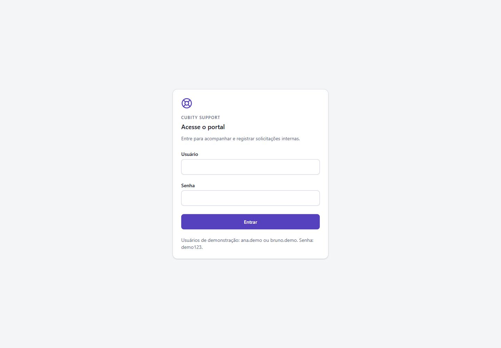

### 02 — Dashboard

Quatro solicitações: duas abertas, uma em atendimento, uma concluída. Os indicadores são globais.

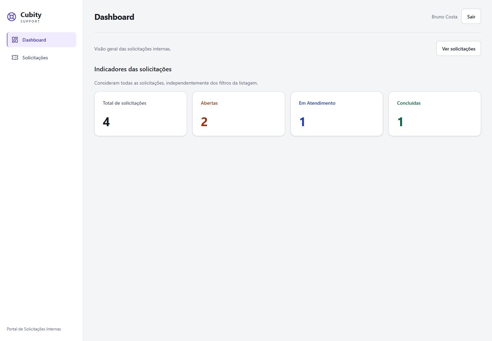

### 03 — Listagem

Dados recuperados após recarga, com código, título, categoria, solicitante, abertura UTC e status.

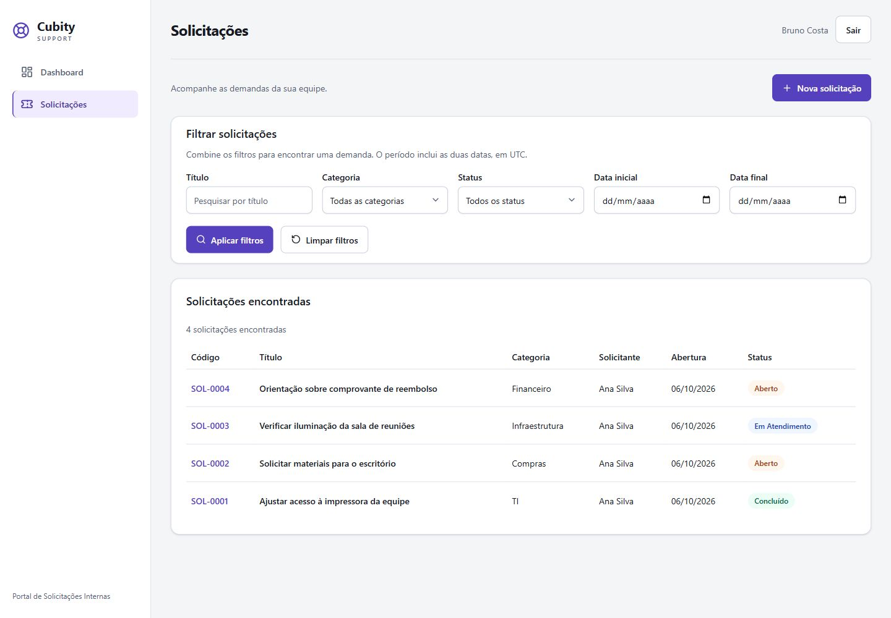

### 04 — Cadastro

Título, descrição e categoria; dados automáticos ficam fora dos campos editáveis.

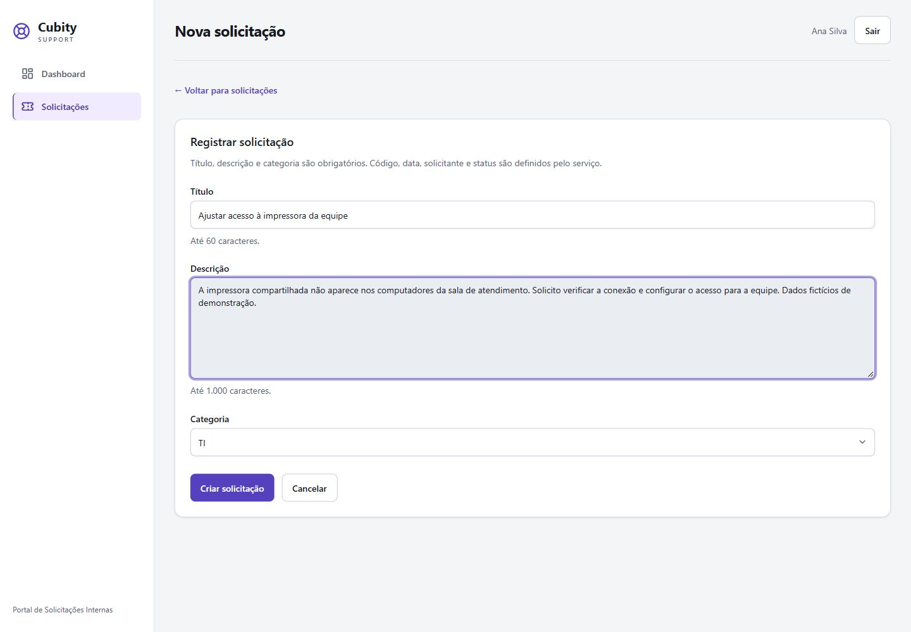

### 05 — Detalhes

Ana consulta sua solicitação aberta, com descrição completa e ações disponíveis.

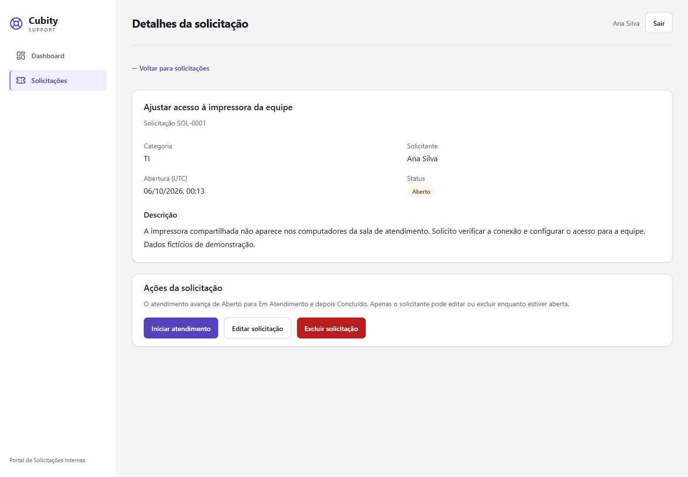

### 06 — Edição

Formulário carregado com os dados persistidos; a edição foi salva durante a validação.

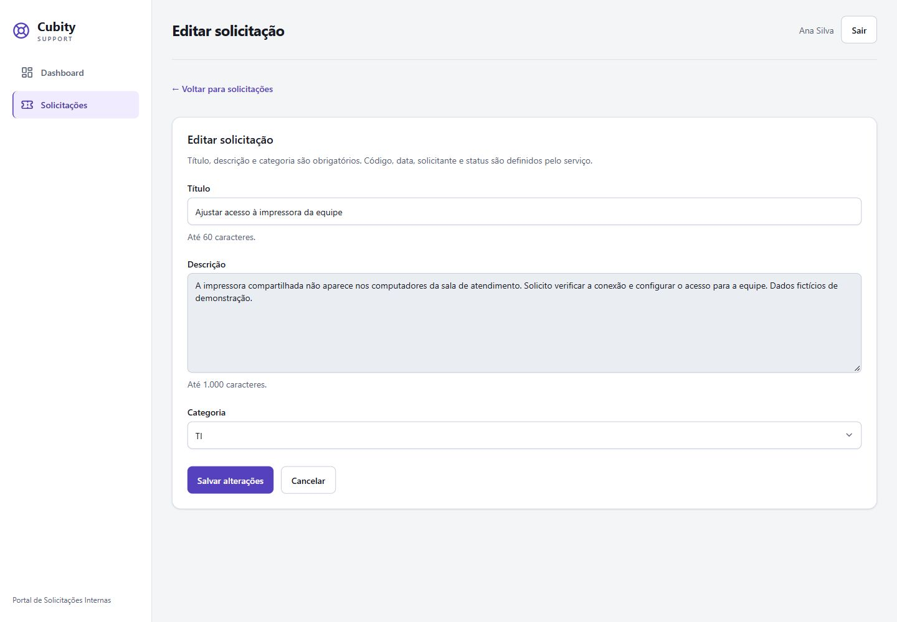

### 07 — Permissões de outro usuário

Bruno consulta a solicitação de Ana e pode iniciar atendimento; edição/exclusão não são oferecidas. O screenshot demonstra a UI; proteção no backend é coberta pelos testes de integração.

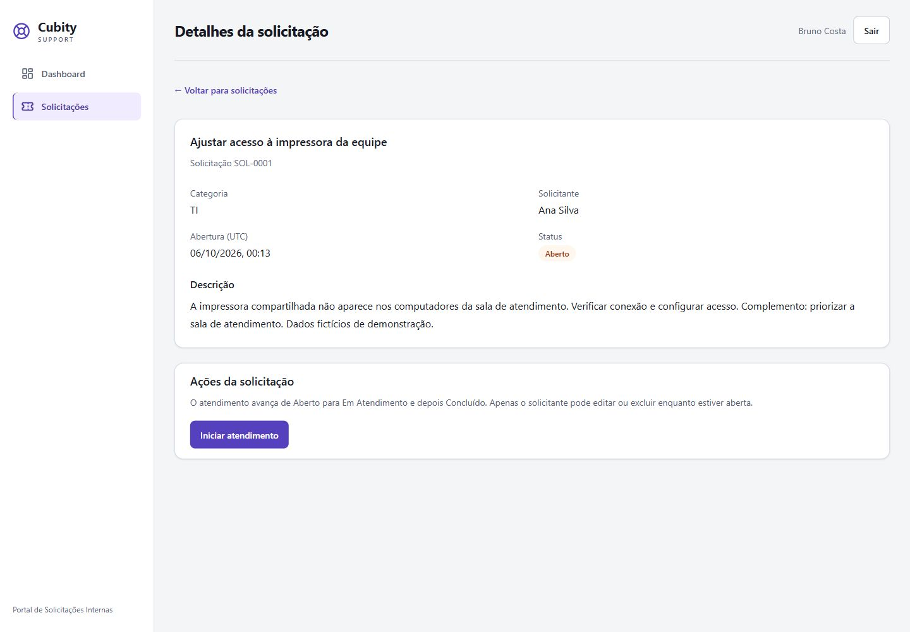

### 08 — Em Atendimento

Estado após iniciar atendimento; a próxima ação é concluir.

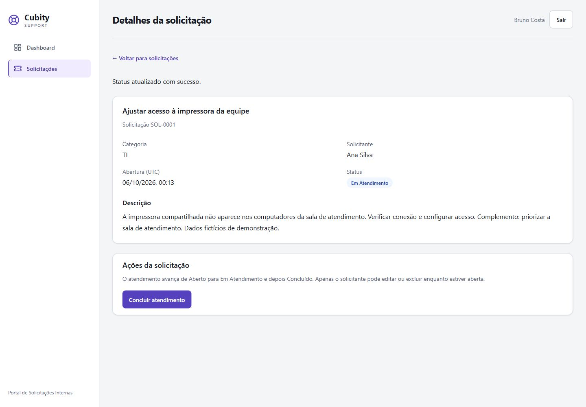

### 09 — Concluído

Estado final, sem ação de reabertura ou retorno de status.

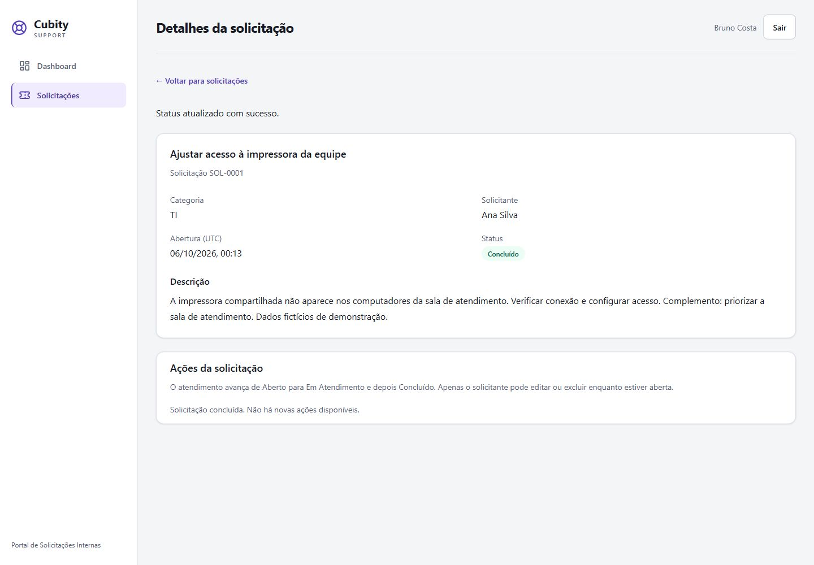

### 10 — Filtros combinados

Título “impressora”, categoria TI e status Concluído retornam uma solicitação. O dashboard continua com os quatro registros globais.

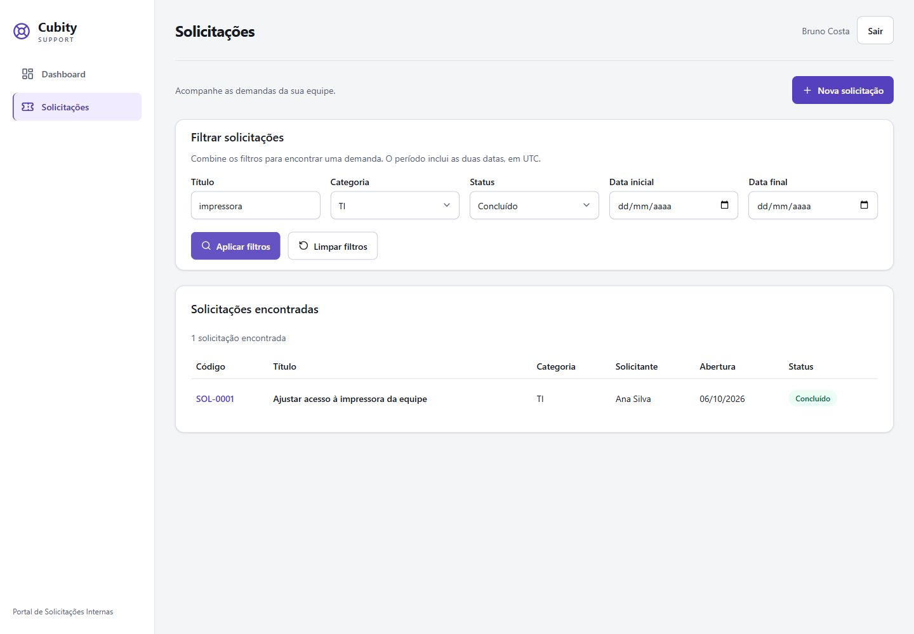

### 11 — Dashboard mobile

Indicadores reorganizados para a largura mobile.

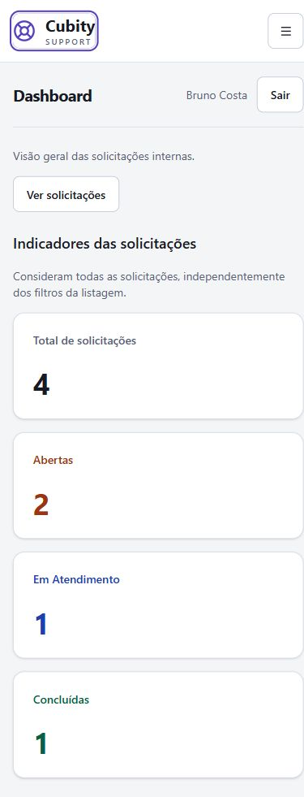

### 12 — Menu mobile e foco

Menu aberto por Enter; foco visível no botão. Escape fecha e devolve o foco ao acionador.

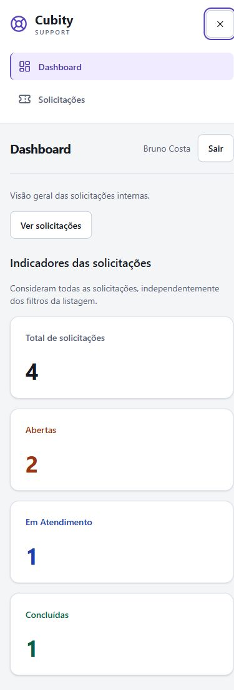

### 13 — Listagem mobile

Filtros em coluna e tabela em região própria de rolagem horizontal, sem alargar a página.

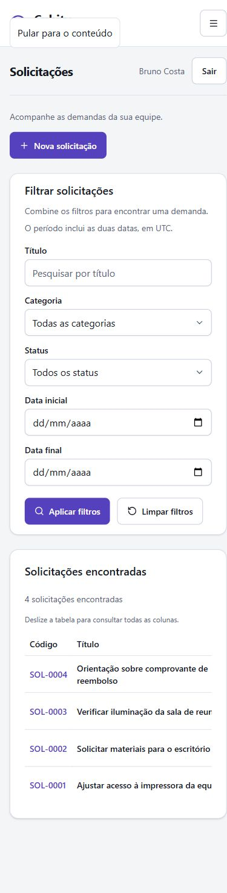

### 14 — Login mobile

Tela obtida após logout, em largura mobile.

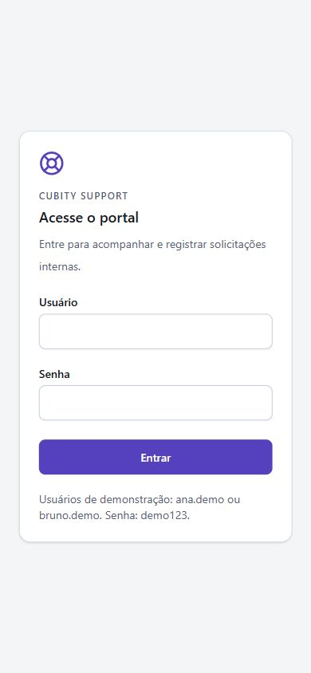

### 15 — Confirmação de exclusão

Diálogo com foco inicial em Cancelar. A captura foi seguida de Escape: a solicitação permaneceu e o foco voltou a Excluir solicitação. Nenhuma exclusão foi confirmada para produzir esta imagem.

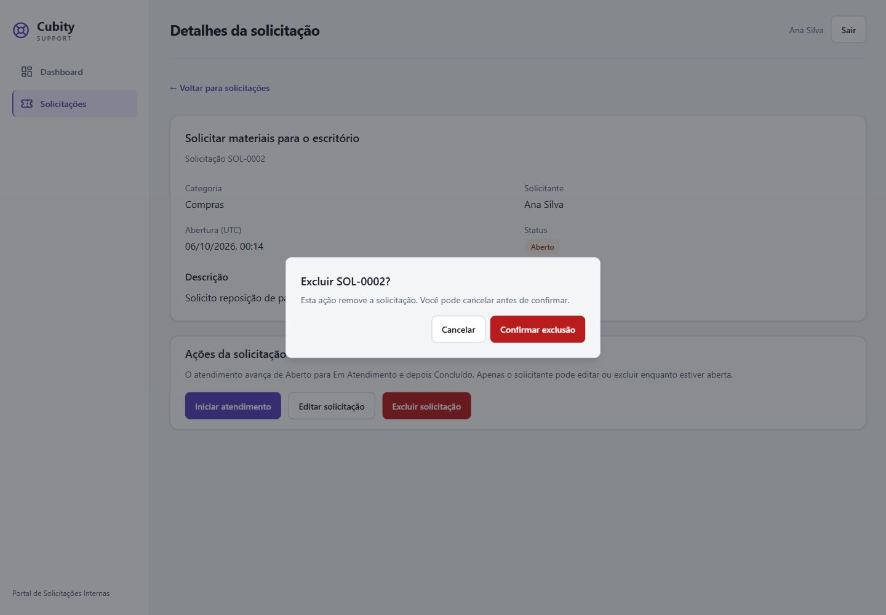

## Reproduzir e atualizar as evidências

1. Executar a stack conforme [guia](../execucao.md), preferencialmente com projeto Compose/volume exclusivos para demonstração.
2. Entrar como ana.demo; criar demandas fictícias nas categorias TI, Compras, Infraestrutura e Financeiro. Editar a demanda TI enquanto aberta.
3. Entrar como bruno.demo; consultar a demanda de Ana, iniciar/concluir TI e iniciar Infraestrutura. Manter Compras/Financeiro abertas.
4. Recarregar a listagem e conferir quatro registros; capturar filtros e dashboard.
5. Verificar desktop/mobile e teclado antes das capturas. Não alterar estilos/DOM para simular resultado.
6. Abrir a confirmação de exclusão como dono de uma aberta e cancelar. Capturar login sem senha preenchida.
7. Salvar JPEGs com os nomes deste índice; revisar imagens e legendas; atualizar [validação](../validacao.md) com os resultados da execução.

Não capturar DevTools com cookies, credenciais, dumps, dados pessoais reais ou telas do Observe com segredos. Não substituir evidências por imagens geradas. Estas capturas não comprovam testes de carga, TLS produtivo, alertas, auditoria de acessibilidade ou funcionamento de funcionalidades fora do escopo.

## Evidências cloud — Observe e Render

As imagens abaixo foram fornecidas pelo responsável; são distintas da galeria local anterior.

### Dashboard NestJS Observe

Captura fornecida pelo responsável em 05/10/2026: o NestJS Observe apresenta 2 requisições na janela de 1 hora, duração média de 4,26 ms, P95 de 5,80 ms e nenhum erro registrado nessa amostra. Isso evidencia ingestão de telemetria no painel; não comprova cobertura completa, alertas ou desempenho sob carga. A versão exibida é `0.1.0`, portanto esta captura não valida a identificação automática pelo commit.

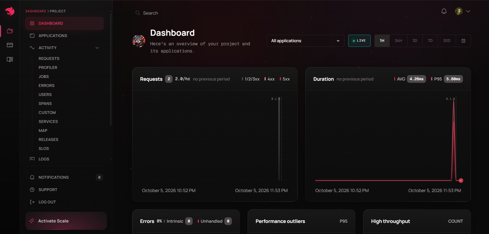

### CD no Render

Captura fornecida pelo responsável em 05/10/2026: o commit `44356b3` aparece Live e possui um deploy concluído com origem **Auto-Deploy**. O merge do PR #24, commit `8193636`, aparece em **Building**, também por Auto-Deploy. A imagem comprova acionamento automático e uma publicação anterior concluída; não comprova conclusão do deploy `8193636` nem bloqueio por falha de CI. O Service ID foi ocultado na imagem fornecida.

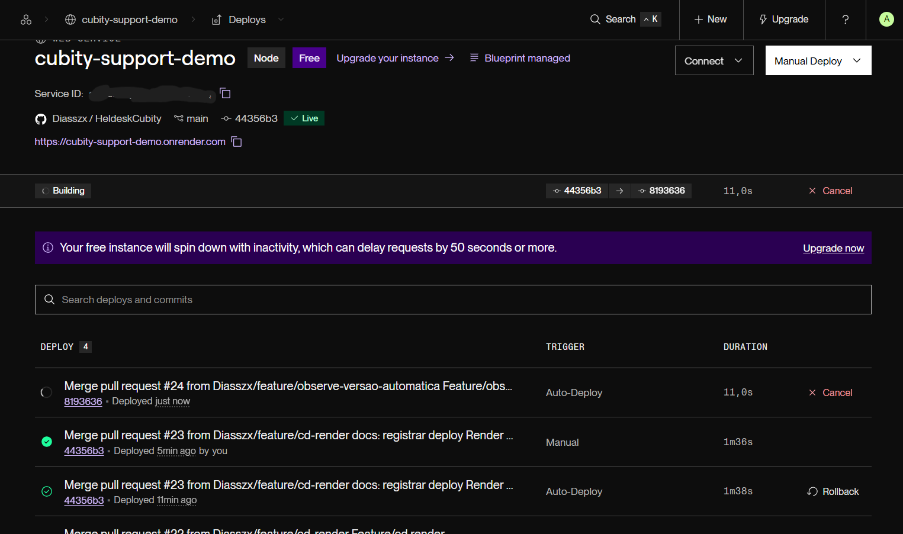
